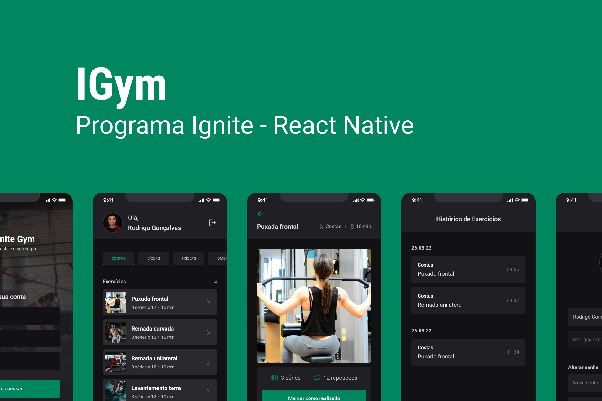

<p align="center">
  
</p>

## **💻** Projeto

Para aprofundar ainda mais meus conhecimentos sendo alinhado com as novas e melhores práticas e tecnologias disponíveis no mundo da tecnologia, desenvolvi a aplicação mobile “Ignite Gym” durante o programa de aceleração “Ignite - React Native”, onde contruímos um sistema de gerenciamento de exercícios, consumindo uma API. Foi utilizado como estilização o Native Base.

<p align="center">
  
</p>

## Tecnologias utilizadas

- [Expo](https://expo.dev/)
- [Typescript](https://www.typescriptlang.org/)
- [ReactJS](https://pt-br.reactjs.org/)
- [NativeBase](https://nativebase.io/)
- [expo-google-fonts/roboto](https://www.npmjs.com/package/@expo-google-fonts/roboto)
- [Axios](https://axios-http.com/ptbr/docs/intro)
- [Yup](https://www.npmjs.com/package/yup)
- [React Hook Form](https://react-hook-form.com/)
- [React Nativation](https://reactnavigation.org/)

## **🔖 Layout**

Você pode visualizar o layout utilizado através do link abaixo:

- [Layout](https://www.figma.com/file/038qBGd45OFi1bY9lGfSDH/Ignite-Gym-Community?is-community-duplicate=1&fuid=)

## **🚀** Como Executar

Antes de baixar o projeto você vai precisar ter instalado na sua máquina as seguintes ferramentas:

- [Git](https://git-scm.com/)
- [NodeJS](https://nodejs.org/en/)
- [NPM](https://www.npmjs.com/)
- [Expo](https://expo.dev/) (para emular na plataforma)

Segue os comandos para baixar e executar o projeto na sua máquina:

```bash
## Clone o projeto em sua máquina
git clone https://github.com/srsouzaj/igym.git

# Acessar o projeto no terminal
$ cd igym

# Instalar as dependências
$ npm install

# Executar o servidor em modo de desenvolvimento
$ npm run start

# Acessar o expo no emulador desejado
```

## 📝 License

Esse projeto está sob a licença MIT. Veja o arquivo [LICENSE](https://github.com/srsouzaj/06-ignite-call/blob/master/LICENSE.md) para mais detalhes.

Feito com ❤️ por Jorge de Souza
